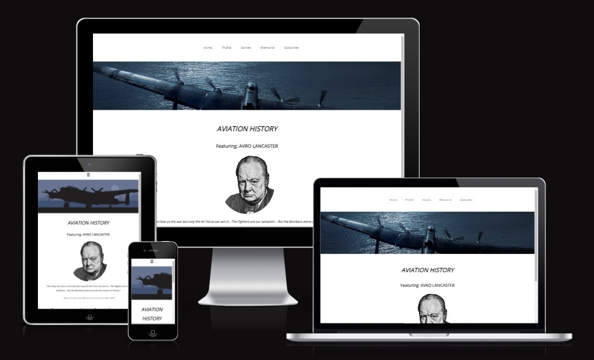

# Aviation History - Featuring Avro Lancaster

Aviation History, specifically spotlight the iconic AVRO Lancaster, holds a mesmerizing charm that resonates with generations. The Lancaster, with its unparalleled contribution during World War II, stands as a symbol of resilience, innovation, and human endeavor.

Where, this site shares a glimps at the rich tapestry of aviation history that isn't just for history buffs or aircraft enthusiasts, but beckons educators, students and even the casual reader with its tales of bravery, engineering marvels and pivital moments that changed world events, stretching generations.

So join me as we delve into this treasure trove of aviation marvel and learn of the technological advancements, societal impacts, and global narratives of that time period which help shaped our modern world.

The purpose of such topics are to provoke critical thinking, insights and public debate that will foster a newfound appreciation for the skies above and the stories they hold.

# Features

## Navigation Bar
A fully responsive design that presents two flavours to the user, depending upon the device used to view the sites content:

(1) Horizontal bar for larger screens that responds to the users cursor highlighting their choice.

(2) A hamburger dropdown menu that appears vertically on the righthandside of the screen for smaller devices.

Note also that screens hero image also changes in response to the change in screen size.
 
## Index Page: 
The main landing page introducing visitors to the over-arching theme of Aviation History with a special focus on the AVRO Lancaster. Featuring the icon figure of Sir Winston Churchill.

## Profile Page: 
A detailed look into the evolution, specification and features of the AVRO Lancaster. With a topographical picture of the aircraft which displays for larger screens but disappears to accomadate smaller screens.

## Stories Page: 
A collection of narratives and anecdotes highlighting significant moments of individuals in aviation history associated with the AVRO Lancaster. Where this on page, it contains a visual portrait of a famous pilot, audio account of the story behind the mission and three videos.

## Memorial Page: 
A tribute section dedicated to those who played crucial roles or sacrificed their lives during this period of aviation history associated with the AVRO Lancaster. This site opens onto a separate tab as it is an external site.

## Subscription Page:
A portal for visitors to sign up and receive regular updates on content from the Aviation History website.

## Testing

Testing of the following webpages: index, profile, stories and subsciption was performed using the 'preview' feature of CodeAnywhere, along with its Browser port and GitHubs Active Deployment feature. Utilizing the 'Google Chrome Developer Tools', it was possible to inspect all screen sizes, which helped to influence the responsive design, images and menu choices. 

In addition to this, the open-sourced tool Lighthouse was used to assess and improve the quality of the webpages developed, which measures five primary categories: Performance, Accessibility, Best Practices, Search Engine Opitmization (SEO) and Progressive Web App (PWA). With particular emphasis during the project paid to accessibility to ensure the site is more accessible to users with disabilities.

### Validator Testing
HTML - No errors were returned when passing through the official W3C validator, please see screenshot.

CSS - No errors were found when passing through the official (Jigsaw) validator, please see screenshot.

Note, most common errors observed where typogrpahical errors, initial mis-use of id's, parent child rules, all of which were rectified.

## Unfixed Bugs, issues and troubleshoots

A Minimum Viable Product (MVP) approach was taken towards the sites development, in order to avoid having unfixed bugs with the time alotted. As a result, a simplied approach was taken to the 'hamburger menu' for this project, which is absent of the functional X orginally intended for close the menu when it is opened. Additionally a reduction in the total number of individually specified Media Queries, limiting it to just two.

While some issues were observed with the IDE Application: Codeanywhere, such as connection time outs, preview delays between code modifications and change in site appearance during testing of pages. In addition a bug occuring when the content is saved within the IDE Appliation only (and not with GitHub) that produced an additional spacing, forward slash at specific points in the code. These were however overcome with frequent github pushes.

Separately, an observed decoupling between CodeAnyWhere and Github occurred, where code scripted in the IDE Application could not be pushed across despite changes being present.

This resulted in the creation of a New Workspace with the same Repository URL which allowed me to save on lost time troubleshooting and continue coding.

 
### Deployment

The site was deployed using GitHub, by visiting the repository, clicking Settings, selecting Pages, and ensuring that the Source was set to Main before Saving. Once the site had refreshed a link appeared on the page with the text: "Your site is live at", which when clicked confirmed a successful deployment.

The live link can be found here - <https://github.com/sdaly-ie/project_1>

### Credits

Include Code Institutes Sample README.md file, its learning curriculum, love running site, coffee house site and a YouTube tutorial called: Responsive Navigation Menu Bar + Hamburger Menu Toggle - Only with CSS, link: <https://www.youtube.com/watch?v=XM7sEpl0f7c>

Site fonts are from Google Fonts, link: <https://fonts.google.com/>

Icons used in the footer were provided by Font Awesome, link: <https://fontawesome.com/>

For site contents please refer to the bibilography section at the end of each relevant page and open source images iStock file ID: 1438478293 (Churchill), 472353351 (Lancaster), 471050093 (Envelope), 454234307 (RAF Roundel), Wikipedia Guy Gibson Portrait link: <https://en.wikipedia.org/wiki/Guy_Gibson#/media/File:Guy_Penrose_Gibson_VC.jpg> and Photo Lancaster 2020 John M Dibbs for educational non commerical use. While the audio file was sourced from the 'RAF Museum website', while the videos displayed are directly linked to the original source material via its iframe.

Finally, extra help on troubleshoots or generalized understanding of code was sourced from: Google Searches, Slack, Tutor support, YouTube and ChatGPT4.
